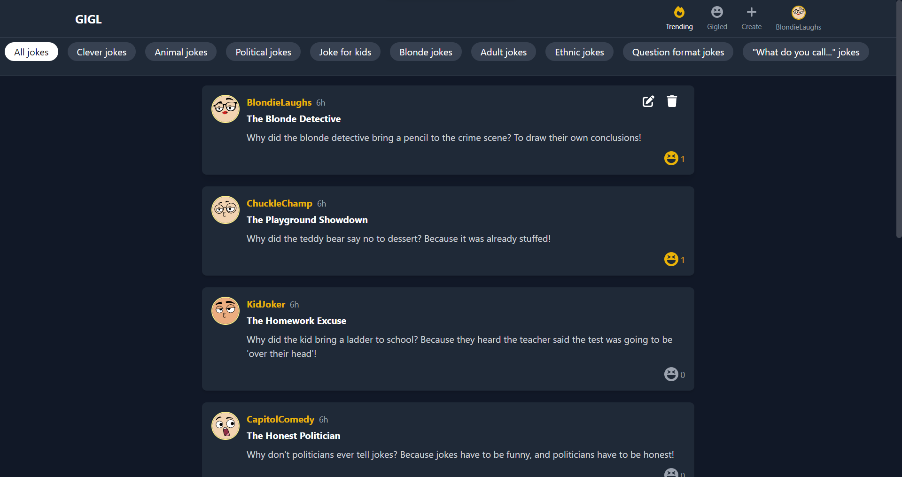
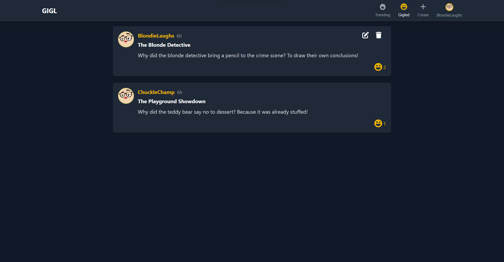
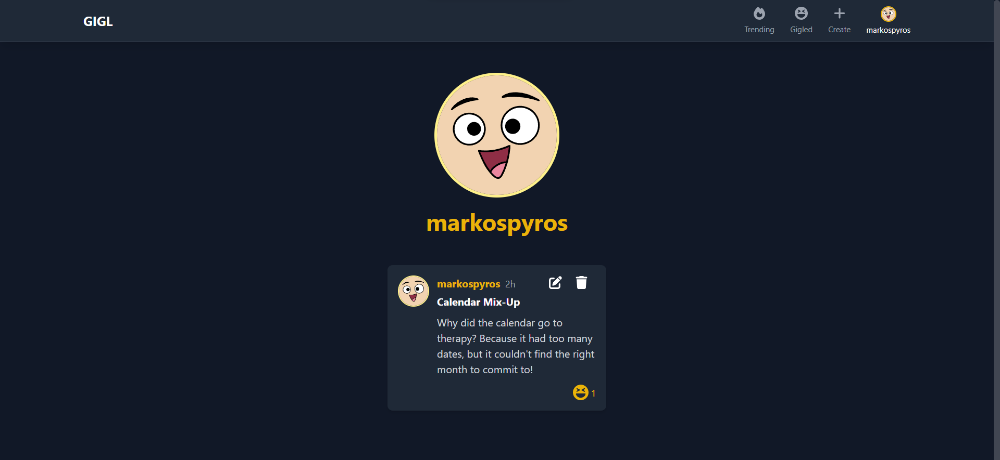
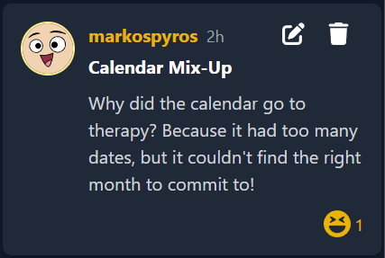

# GIGL Web Application

GIGL is a platform where comedians can showcase their humor by posting jokes and get them liked or "gigled" by fellow comedians. Users can browse different jokes based on their categories, like them, and even maintain their own profile of jokes.

## Visit the Application

For a live version of the GIGL web application, please visit [https://gigl-api20230911195337.azurewebsites.net/](https://gigl-api20230911195337.azurewebsites.net/).

## Pages Overview

- **Trending**: Displays a list of the most popular and trending jokes on the platform.
  
  

- **Gigled**: Shows a list of jokes that the signed-in comedian has "gigled" or liked.
  
  

- **Create**: A page where comedians can create and post a new joke.
  
  

- **Profile**: Allows comedians to view and edit their personal information, see the jokes they've posted, and manage the jokes they've "gigled".
  
  

## Components

### JokeCard

This component displays an individual joke. It presents the joke's title, content, number of "gigles", as well as the author's username. The card might also have buttons or actions to "gigle" a joke, share it, or view more details.

## Technologies Used

- **Backend**: 
  - ASP.NET Core
  - Entity Framework Core
- **Frontend**: 
  - React.js
  - Tailwind CSS

## Endpoints

### Account

- **POST /CreateComedian**: Endpoint to create a new comedian profile.
- **GET /ShowProfile**: Fetches the profile of a specific comedian.
- **GET /IdentifySignedInUser**: Identifies which comedian is currently signed in.

### Joke

- **GET /ListJokeTypes**: Lists all available joke types or categories.
- **POST /MakeAJoke**: Endpoint to post a new joke.
- **DELETE /DeleteAJoke**: Deletes a specific joke.
- **POST /EditAJoke**: Edits the details of an existing joke.
- **GET /ListJokesBasedByCategory**: Lists jokes based on a specific category.
- **POST /LikeAJoke**: "Gigles" or likes a specific joke.
- **POST /IsAJokeGigledByUser**: Checks if a joke has been "gigled" by a specific user.
- **GET /ListGigledJokes**: Lists all jokes that a comedian has "gigled".
- **GET /ShowUsersJokes**: Shows all jokes posted by a specific comedian.

## Entities

### Comedian

Attributes:
- **Id (String)**: Unique identifier for the comedian.
- **Username (String)**: A unique username chosen by the comedian.
- **ProfileImage (String)**: URL to the comedian's profile picture, with a default value.
- **DateJoined (DateTime)**: The date when the comedian joined the GIGL platform.

Relationships:
- **Jokes (List of Joke)**: A list of jokes that this comedian has created.
- **LikedJokes (List of ComedianJoke)**: A list of jokes that this comedian has "gigled" or liked.

### Joke

Attributes:
- **Id (String)**: Unique identifier for the joke.
- **ComedianId (String)**: ID of the comedian who created the joke.
- **ComedianUsername (String?)**: Optional username of the comedian associated with the joke.
- **Date (DateTime)**: The date when the joke was created.
- **Title (String)**: Title or header for the joke.
- **Content (String)**: The actual content or body of the joke.
- **Gigls (Int)**: Number of "gigles" or likes the joke has received.
- **Category (String)**: The category or type of joke (with a default value of "All jokes").

Relationships:
- **Comedian (Comedian)**: The comedian who created this joke. 
- **ComediansThatGigled (List of ComedianJoke)**: A list of comedians who have "gigled" or liked this joke.

### ComedianJoke

Attributes:
- **ComedianId (String)**: ID of the comedian associated with a specific joke.
- **JokeId (String)**: ID of the joke that is associated with a comedian.

Relationships:
- **Comedian (Comedian)**: The comedian associated with a specific joke.
- **Joke (Joke)**: The joke associated with a specific comedian.
